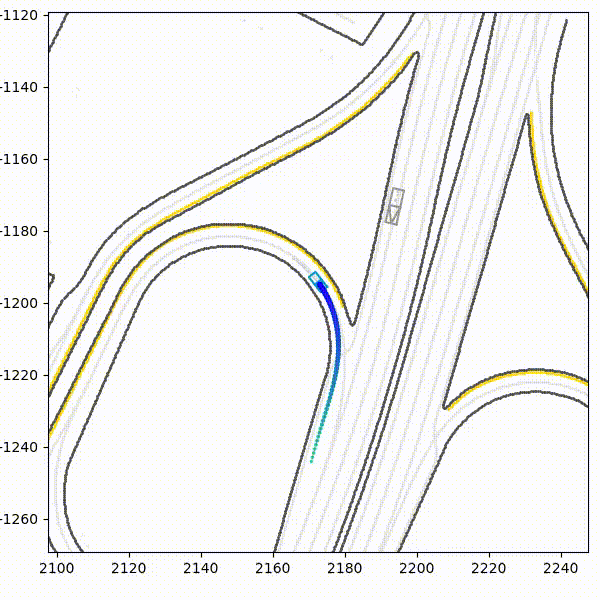
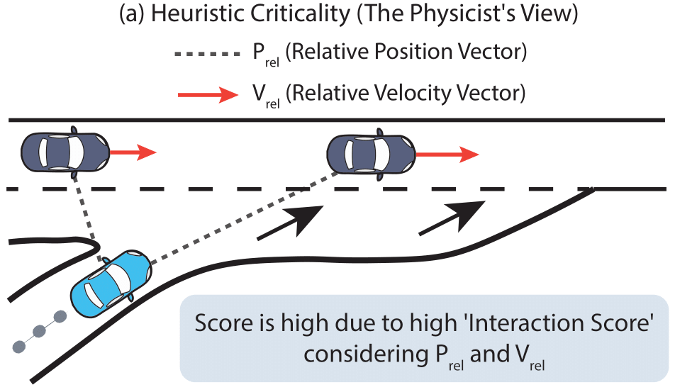
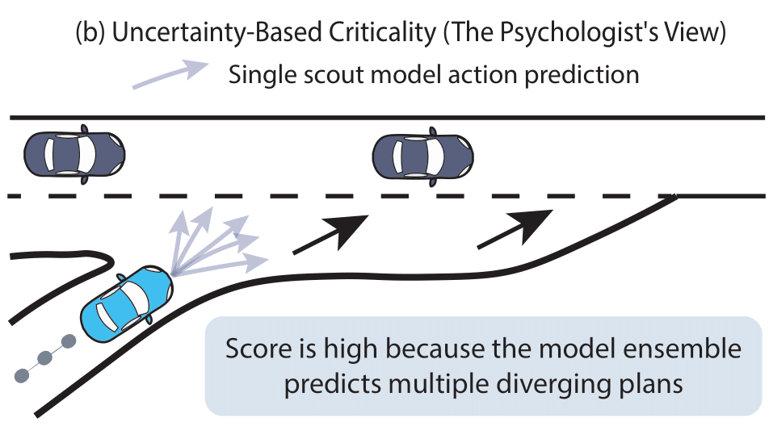
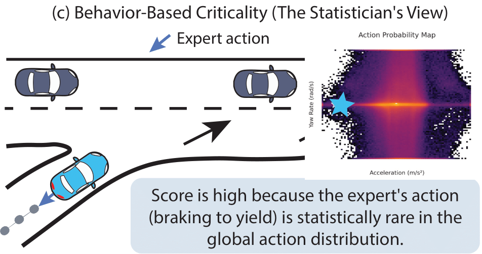

# Mining the Long Tail: A Data-Centric Approach to Robust Offline RL for Autonomous Motion Planning

<p align="center">
  This repository contains the official implementation for "Mining the Long Tail," a large-scale study on data curation for training robust, long-horizon motion planners for autonomous driving.
</p>

<p align="center">
  <a href="https://arxiv.org/abs/2508.07029" target="_blank">
    
  </a>
  <a href="http://arxiv.org/licenses/nonexclusive-distrib/1.0/" target="_blank">
    
  </a>
  <a href="LICENSE">
    
  </a>
  <a href="https://pytorch.org/">
    
  </a>
  
</p>

<p align="center">
  A project by <strong>Antonio Guillen-Perez</strong> | 
  <a href="https://antonioalgaida.github.io/" target="_blank"><strong>Portfolio</strong></a> | 
  <a href="https://www.linkedin.com/in/antonioguillenperez/" target="_blank"><strong>LinkedIn</strong></a> | 
  <a href="https://scholar.google.com/citations?user=BFS6jXwAAAAJ" target="_blank"><strong>Google Scholar</strong></a>
</p>


## Table of Contents
- [Mining the Long Tail: A Data-Centric Approach to Robust Offline RL for Autonomous Motion Planning](#mining-the-long-tail-a-data-centric-approach-to-robust-offline-rl-for-autonomous-motion-planning)
  - [Table of Contents](#table-of-contents)
  - [Overview \& Key Result](#overview--key-result)
  - [Repository Structure](#repository-structure)
  - [Project Overview](#project-overview)
  - [The Core Contribution: A Framework for Criticality-Aware Data Curation](#the-core-contribution-a-framework-for-criticality-aware-data-curation)
    - [1. Heuristic-Based Criticality (The "Physicist's View")](#1-heuristic-based-criticality-the-physicists-view)
    - [2. Uncertainty-Based Criticality (The "Psychologist's View")](#2-uncertainty-based-criticality-the-psychologists-view)
    - [3. Behavior-Based Criticality (The "Statistician's View")](#3-behavior-based-criticality-the-statisticians-view)
  - [Key Quantitative Results](#key-quantitative-results)
  - [Acknowledgments and Citation](#acknowledgments-and-citation)
    - [Citing this Work](#citing-this-work)
  - [Setup and Reproducibility](#setup-and-reproducibility)
    - [Prerequisites](#prerequisites)
    - [Step 1: Clone the Repository](#step-1-clone-the-repository)
    - [Step 2: Create Conda Environments](#step-2-create-conda-environments)
    - [Step 3: Download the Waymo Open Motion Dataset](#step-3-download-the-waymo-open-motion-dataset)
  - [How to Run the Pipeline](#how-to-run-the-pipeline)
    - [Stage 1: Offline Data Processing (The "Data Factory")](#stage-1-offline-data-processing-the-data-factory)
      - [**Step 1.1: Parse Raw Data**](#step-11-parse-raw-data)
      - [**Step 1.2: Featurize Scenarios**](#step-12-featurize-scenarios)
    - [Stage 2: Metadata Generation (The "Data Intelligence" Layer)](#stage-2-metadata-generation-the-data-intelligence-layer)
      - [**Step 2.1: Compute Feature Statistics**](#step-21-compute-feature-statistics)
      - [**Step 2.2: Compute Action Distribution Weights**](#step-22-compute-action-distribution-weights)
    - [Stage 3: Criticality Scoring (The "Curation" Layer)](#stage-3-criticality-scoring-the-curation-layer)
      - [**Step 3.1: Heuristic-Based Scoring**](#step-31-heuristic-based-scoring)
      - [**Step 3.2: Uncertainty-Based Scoring**](#step-32-uncertainty-based-scoring)
      - [**Step 3.3: Behavior-Based Scoring**](#step-33-behavior-based-scoring)
    - [Stage 4: Training and Evaluation (The "Experiment" Layer)](#stage-4-training-and-evaluation-the-experiment-layer)
      - [**Step 4.1: Train the CQL Agents**](#step-41-train-the-cql-agents)
      - [**Step 4.2: Monitor Training and Select Best Checkpoint**](#step-42-monitor-training-and-select-best-checkpoint)
      - [**Step 4.3: Run Final Evaluation**](#step-43-run-final-evaluation)
      - [**Step 4.4: Analyze Results and Generate Figures**](#step-44-analyze-results-and-generate-figures)
  - [Troubleshooting \& FAQ](#troubleshooting--faq)
  - [Contributing \& Questions](#contributing--questions)
  - [License](#license)


---
## Overview & Key Result

This project investigates data curation strategies to solve the **long-tail problem** in autonomous driving. Standard Offline RL agents, trained on the raw, imbalanced data distribution, often fail in rare, critical scenarios. By intelligently re-weighting the training data to focus on the most informative samples, our methods produce significantly safer and more robust policies.

The animation below showcases the dramatic performance difference in a challenging highway merging scenario, comparing our two primary data curation philosophies against the baseline.

<div align="center">

| Baseline CQL Agent | Heuristic-Weighted Agent (CQL-H) | Uncertainty-Weighted Agent (CQL-E) |
| :---: | :---: | :---: |
|  |  |  |
| **FAIL:** The baseline agent is indecisive and fails to accelerate appropriately, resulting in a collision. | **SUBOPTIMAL:** The heuristic agent safely merges *behind* the other vehicle, but its maneuver is reactive and overly cautious. | **SUCCESS:** The uncertainty agent proactively and confidently merges *in front*, executing a safe, smooth, and human-like maneuver. |

</div>

This qualitative result highlights our key quantitative finding: while heuristic-based curation provides a significant improvement, the data-driven uncertainty-based approach learns the most robust and sophisticated policy.

## Repository Structure

The project is organized into a modular structure to separate data processing, model implementation, and evaluation logic.

```
LongTailOfflineRL/
├── configs/              # Main configuration file (main_config.yaml)
├── data/                 # (Git-ignored) Placeholder for all generated datasets
├── models/               # (Git-ignored) Placeholder for saved model checkpoints
├── notebooks/            # Jupyter notebooks for analysis and figure generation
├── outputs/              # (Git-ignored) Default location for evaluation results (videos, JSONs)
├── runs/                 # (Git-ignored) Default location for TensorBoard logs
├── src/                  # Main source code
│   ├── data_processing/  # Scripts for parsing, featurizing, and scoring data
│   ├── evaluation/       # Scripts and utilities for closed-loop evaluation
│   └── rl/               # Core RL components (agent, networks, datasets)
└── tests/                # Unit and integration tests for key modules
```

## Project Overview

The goal of this research is to develop a robust motion planner for autonomous vehicles using Offline Reinforcement Learning (RL). While learning from massive, real-world driving logs is a promising approach, these datasets are fundamentally imbalanced: the vast majority of the data represents simple, mundane driving, while safety-critical "long-tail" events (like emergency braking or complex merges) are extremely rare.

An agent trained naively on this data becomes an expert at easy driving but fails dangerously in the rare situations where true intelligence is required. This project tackles this **long-tail problem** with a data-centric approach. Instead of treating all data as equal, our pipeline first analyzes the entire dataset to assign a "criticality score" to every moment.

We designed and systematically compared six different methods for scoring criticality, grouped into three core philosophies:
1.  **Heuristic-Based:** Using domain knowledge and physics (e.g., Time-to-Collision) to identify dangerous situations.
2.  **Uncertainty-Based:** Using a model ensemble's disagreement to find situations that are ambiguous or confusing.
3.  **Behavior-Based:** Using the statistical rarity of the expert driver's own actions to find unusual maneuvers.

By re-weighting the training data to focus the agent's learning on these high-scoring samples, we are able to train a policy that is significantly safer and more robust. Our final results show that this data-centric approach drastically reduces safety-critical failures, with our top-performing agent achieving a **nearly 3x reduction in collisions** compared to a standard baseline, demonstrating that intelligent data curation is a critical component for building safe, real-world autonomous agents.


---
## The Core Contribution: A Framework for Criticality-Aware Data Curation

Our central contribution is a systematic framework for solving the long-tail problem by focusing an Offline RL agent's attention on the most information-rich samples. We move beyond uniform sampling by first processing the entire dataset to generate a "criticality score" for every moment. We designed and compared three distinct, orthogonal philosophies for defining this score.

---
### 1. Heuristic-Based Criticality (The "Physicist's View")

This approach uses explicit, human-defined domain knowledge to identify situations that are physically dangerous or complex. It's based on the idea that we can encode our expert understanding of "what is risky" directly into the data. The score is a weighted sum of five key signals, including **Kinematic Volatility** (high jerk/yaw acceleration) and a novel **Interaction Score** that identifies latent collision risks by analyzing converging velocity vectors between agents.

| **Core Concept: Latent Risk Detection** |
| :---: |
|  |
| *A high score is assigned when the relative position and velocity of two agents indicate a high probability of a future collision, even if they are currently far apart.* |

This method is transparent and effective at capturing well-understood critical events.

---
### 2. Uncertainty-Based Criticality (The "Psychologist's View")

This is a more advanced, data-driven approach that tests the hypothesis that the most valuable samples are those where a simpler model is most **uncertain** or "confused." This allows the system to automatically discover its own "known unknowns" and create a self-generated curriculum. We first train an ensemble of K-fold "scout" models and then define criticality as the disagreement in their predictions.

| **Core Concept: Model Disagreement** |
| :---: |
|  |
| *A high score is assigned when the scout models predict multiple, conflicting future plans (e.g., merge in front vs. merge behind), indicating a situation that is ambiguous and requires complex reasoning.* |

This method excels at identifying states that are on the edge of the learned data distribution, forcing the final agent to become more robust in situations that are not easily solved by simple imitation.

---
### 3. Behavior-Based Criticality (The "Statistician's View")

This philosophy is orthogonal to the others. It is agnostic to the context of the scene and focuses entirely on the **expert's own behavior**. The core idea is that the most critical events are those that forced the expert driver to execute a statistically rare maneuver. This directly addresses the action distribution imbalance in the dataset.

| **Core Concept: Action Rarity** |
| :---: |
|  |
| *A high score is assigned when the expert's action (e.g., a hard brake) falls into a low-density, "cold" region of the global action distribution heatmap, which is dominated by the "hotspot" of common, near-zero actions.* |

This method is powerful because it uses the expert's own reactions as the ultimate signal of what is unusual and important, allowing the agent to focus on mastering the long tail of the expert's behavioral repertoire.

---
## Key Quantitative Results

We trained seven distinct agents and evaluated them over 1,000 held-out, challenging scenarios in the Waymax simulator. The results demonstrate a clear and significant performance improvement from our data curation strategies.

The table below summarizes the performance of our top-performing agent from each of the three curation philosophies against the baselines on the most critical safety and goal-achievement metrics.

| Agent                  | Collision Rate ↓ | Off-Road Rate ↓ | Success Rate ↑ |
| :--------------------- | :--------------: | :-------------: | :------------: |
| **Baseline (CQL)**     |      16.0%       |      29.5%      |     63.5%      |
| **Baseline (CQL+BC)**  |      14.0%       |      24.0%      |     64.5%      |
| **Heuristic (CQL-H)**  |       8.0%       |      20.5%      |     74.5%      |
| **Behavioral (CQL-AR)**|       6.5%       |      16.5%      |     79.5%      |
| **Uncertainty (CQL-E)**|   **_5.5%_**     |   **_15.0%_**   |  **_81.0%_**   |

**Key Takeaways:**
*   All data curation methods dramatically outperform the baselines in safety and success rate.
*   The data-driven approaches (Uncertainty and Behavioral) achieve the best results, with the **Uncertainty-based agent (CQL-E) reducing collisions by 2.9x** and **increasing the success rate by 27%** compared to the standard CQL baseline.
*   This provides strong quantitative evidence that focusing an agent's training on information-rich, long-tail events is critical for learning a robust driving policy.
  

---
## Acknowledgments and Citation

This research was made possible by the use of the following outstanding, publicly available datasets and simulation tools. We extend our sincere gratitude to the research teams at Waymo for providing these resources to the community.

*   **[Waymo Open Motion Dataset (WOMD)](https://waymo.com/open/data/motion/)**: The large-scale, real-world dataset used for all training and evaluation in this project.
*   **[Waymax Simulator](https://github.com/waymo-research/waymax)**: The high-fidelity, JAX-based simulator used for all closed-loop evaluation.

### Citing this Work

If you find this work useful in your own research, please consider citing our paper:

```bibtex
@article{GuillenPerez2024Mining,
  title   = {Mining the Long Tail: A Comparative Study of Data-Centric Criticality Metrics for Robust Offline Reinforcement Learning in Autonomous Motion Planning},
  author  = {Guillen-Perez, Antonio},
  journal = {arXiv preprint arXiv:2508.07029},
  year    = {2025}
}
```

---
## Setup and Reproducibility

This project is built using Python 3.10 and PyTorch. The following instructions detail how to set up the necessary environments and download the required dataset.

### Prerequisites

*   **OS:** A Linux-based operating system (e.g., Ubuntu 20.04+) or Windows with WSL2.
*   **GPU:** An NVIDIA GPU with at least 24GB of VRAM is recommended for training and evaluation (e.g., RTX 3090 / 4090).
*   **Software:**
    *   [Anaconda or Miniconda](https://docs.conda.io/en/latest/miniconda.html) for environment management.
    *   [NVIDIA Drivers](https://www.nvidia.com/Download/index.aspx) compatible with CUDA 12.1.
    *   [Google Cloud SDK](https://cloud.google.com/sdk/docs/install) for downloading the dataset (`gsutil`).

### Step 1: Clone the Repository

```bash
git clone https://github.com/AntonioAlgaida/LongTailOfflineRL.git
cd LongTailOfflineRL
```

### Step 2: Create Conda Environments

This project uses two separate Conda environments to manage dependencies safely. The provided `.yml` files allow for one-step creation.

**1. The Parser Environment (`womd-parser`):**
This is a lightweight environment that includes TensorFlow and is used *only* for the initial data parsing step.

```bash
conda env create -f environment_parser.yml
```

**2. The Main Training Environment (`cql-trainer`):**
This is the primary environment, built with PyTorch 2.1 and CUDA 12.1. All training, scoring, and evaluation scripts are run using this environment.

```bash
conda env create -f environment_cql_trainer.yml
```

### Step 3: Download the Waymo Open Motion Dataset

You will need to download the raw scenario data (`.tfrecord` files) from the Waymo Open Motion Dataset v1.2. We will download a subset for this project, which requires approximately 32GB of disk space.

Create a directory to store the datasets, for example:
```bash
mkdir -p /path/to/your/datasets/waymo_open_motion_v1_2/uncompressed/scenario/
```

Then, use the `gsutil` command-line tool to download the training and validation shards. The commands below download the first 100 shards of the training data and all 150 shards of the validation data.

**Download Training Data (First 100 of 1,000 shards):**
```bash
gsutil -m cp -r "gs://waymo_open_dataset_v_2_0_0/uncompressed/scenario/training/training.tfrecord-00{000..099}-of-01000" /path/to/your/datasets/waymo_open_motion_v1_2/uncompressed/scenario/training/
```

**Download Validation Data (All 150 shards):**
```bash
gsutil -m cp -r "gs://waymo_open_dataset_v_2_0_0/uncompressed/scenario/validation/validation.tfrecord-00{000..149}-of-00150" /path/to/your/datasets/waymo_open_motion_v1_2/uncompressed/scenario/validation/
```
**Important:** After downloading, you must update the `raw_data_dir` path in your `configs/main_config.yaml` file to point to the `/path/to/your/datasets/waymo_open_motion_v1_2/uncompressed/scenario/` directory.

---
## How to Run the Pipeline

The project is organized into a sequential pipeline of scripts. Please run them in the order presented below. All commands should be executed from the root directory of the project (`LongTailOfflineRL/`).

### Stage 1: Offline Data Processing (The "Data Factory")

This stage converts the raw Waymo `.tfrecord` files into the final, structured, and goal-conditioned training samples that our models require. This is a one-time, computationally intensive process.

#### **Step 1.1: Parse Raw Data**

This script reads the raw `.tfrecord` files and converts them into a clean, intermediate `.npz` format. This decouples our project from the heavy TensorFlow dependency of the source data.

**Activate the parser environment:**
```bash
conda activate womd-parser
```

**Run the parser:**
```bash
python -m src.data_processing.parser
```
*   **Input:** Raw `.tfrecord` files from the path specified in `data.raw_data_dir` in your config.
*   **Output:** A set of `.npz` files (one per scenario) will be created in the `data/processed_npz/` directory (or the path specified in `data.processed_npz_dir`). This will create `training` and `validation` subdirectories.

---
#### **Step 1.2: Featurize Scenarios**

This is the main feature engineering step. It reads the `.npz` files and performs the following for every valid timestep:
1.  Generates the structured, goal-conditioned state dictionary using the `FeatureExtractor`.
2.  Calculates the ground-truth expert action (`[acceleration, yaw_rate]`) using the official Waymax `InvertibleBicycleModel`.

The final samples, each a dictionary containing the `state` dictionary and `action` array, are saved in a format optimized for fast loading in PyTorch.

**Activate the main training environment:**
```bash
conda activate cql-trainer
```

**Run the featurizer:**
```bash
python -m src.data_processing.featurizer
```
*   **Input:** The `.npz` files from `data/processed_npz/`.
*   **Output:** A new set of `.pt` files will be created in the `data/featurized_v2/` directory. Each `.pt` file contains a list of all valid `(state_dict, action)` samples for a single scenario.

### Stage 2: Metadata Generation (The "Data Intelligence" Layer)

This stage analyzes the entire featurized training dataset to generate two critical metadata files. These files are prerequisites for all model training, as they provide the necessary statistics for data normalization and for implementing our behavior-based criticality metrics.

**Important:** Ensure the `cql-trainer` environment is active for this entire stage.

---
#### **Step 2.1: Compute Feature Statistics**

This script iterates through all the structured training samples created in the previous stage and calculates the mean and standard deviation for every single feature dimension. This is essential for normalizing the network inputs during training, which is critical for stability and performance.

**Run the statistics computation:**
```bash
python -m src.data_processing.compute_feature_stats
```
*   **Input:** The `.pt` files from `data/featurized_v2/training/`.
*   **Output:** A single file named `feature_stats_v2.npz` will be created in your main data directory. This file contains a dictionary of the mean and standard deviation tensors for each component of the state (e.g., `ego_mean`, `agents_std`, etc.).

---
#### **Step 2.2: Compute Action Distribution Weights**

This script analyzes the distribution of all expert actions in the training set. It builds a fine-grained 2D histogram to model the probability of each action and then calculates the inverse frequency. This provides a powerful signal of "action rarity" that is used by both the `WeightedMSELoss` and the `CQL-AR` agent.

**Run the action weight computation:**
```bash
python -m src.data_processing.compute_action_weights
```
*   **Input:** The `.pt` files from `data/featurized_v2/training/`.
*   **Output:** A single file named `action_weights_v2.pt` will be created in your main data directory. This file contains the action frequency histogram and the bin definitions.


### Stage 3: Criticality Scoring (The "Curation" Layer)

This stage is the heart of the project. Here, we run the various scoring pipelines to generate the criticality scores that will be used to weight the training data for our experimental agents. This stage is divided into three parts, one for each of our curation philosophies.

**Important:** Ensure the `cql-trainer` environment is active for this entire stage.

---
#### **Step 3.1: Heuristic-Based Scoring**

This pipeline uses our suite of researcher-grade, physics-based heuristics (Kinematic Volatility, Interaction Score, etc.) to score the data.

**Run the timestep-level scoring (for `CQL-H`):**
```bash
python -m src.data_processing.score_criticality_heuristic
```
*   **Input:** The raw trajectory data from `data/processed_npz/`.
*   **Output:** Creates `.npz` files in `data/criticality_scores_v2/timestep_level/heuristic/`, with each file containing a dictionary of the raw, unweighted score components for one scenario.

**Run the scenario-level scoring (for `CQL-HS`):**
```bash
python -m src.data_processing.score_criticality_heuristic_scenario
```
*   **Input:** The timestep-level heuristic scores generated above.
*   **Output:** A single file, `heuristic_scenario_scores.pt`, in `data/criticality_scores_v2/scenario_level/`, containing a dictionary mapping each scenario ID to a single aggregated difficulty score.

---
#### **Step 3.2: Uncertainty-Based Scoring**

This is a two-step process that first trains the scout models and then uses them to score the data based on their prediction disagreement.

**First, train the scout model ensemble:**
This script trains a K-fold ensemble of lightweight, attention-based Behavioral Cloning models. This is a lengthy, GPU-intensive training process and is a prerequisite for the next step.
```bash
python -m src.data_processing.train_scout_ensemble
```
*   **Input:** The featurized `.pt` files, `feature_stats_v2.npz`, and `action_weights_v2.pt`.
*   **Output:** A set of `K` trained scout model checkpoints (`.pth` files) in the `models/scout_ensemble/` directory.

**Then, run the scoring scripts using the trained ensemble:**

**Run the timestep-level scoring (for `CQL-E`):**
```bash
python -m src.data_processing.score_criticality_ensemble
```
*   **Input:** The trained scout models and the featurized `.pt` files.
*   **Output:** Creates `.npz` files in `data/criticality_scores_v2/timestep_level/ensemble/`.

**Run the scenario-level scoring (for `CQL-ES`):**
```bash
python -m src.data_processing.score_criticality_ensemble_scenario
```
*   **Input:** The trained scout models and the featurized `.pt` files.
*   **Output:** A single file, `ensemble_scenario_scores.pt`, in `data/criticality_scores_v2/scenario_level/`.

---
#### **Step 3.3: Behavior-Based Scoring**

This pipeline uses the pre-computed action distribution statistics to score data based on the rarity of the expert's behavior.

**Run the timestep-level scoring (for `CQL-AR`):**
```bash
python -m src.data_processing.score_criticality_action
```
*   **Input:** The featurized `.pt` files and the `action_weights_v2.pt` file.
*   **Output:** Creates `.npz` files in `data/criticality_scores_v2/timestep_level/action_rarity/`.

**Run the scenario-level scoring (for `CQL-ARS`):**
```bash
python -m src.data_processing.score_criticality_action_scenario
```
*   **Input:** The timestep-level action rarity scores generated above.
*   **Output:** A single file, `action_rarity_scenario_scores.pt`, in `data/criticality_scores_v2/scenario_level/`.

### Stage 4: Training and Evaluation (The "Experiment" Layer)

This is the final stage where we train our seven CQL agents using the curated data and then evaluate their performance in the Waymax simulator to generate our final results.

**Important:** Ensure the `cql-trainer` environment is active and you are on a machine with a capable NVIDIA GPU.

---
#### **Step 4.1: Train the CQL Agents**

The `src/rl/train.py` script is the unified entry point for training all experimental agents. You will run this script multiple times, once for each agent type, using the `--agent_type` and `--run_name` flags to configure each experiment.

**Example: Training the `CQL-H` (Heuristic Timestep) Agent**
This command will start a training run for the `CQL-H` agent. The logs and model checkpoints will be saved under a directory named based on the `run_name`.

```bash
python -m src.rl.train --agent_type heuristic --run_name CQL_H_run1
```

**Training All Agents:**
To reproduce the full set of experiments, run the command above for each of the seven agent types:
*   `--agent_type baseline` (run name e.g., `CQL_Baseline_run1`)
*   `--agent_type cql_bc` (run name e.g., `CQL_BC_run1`)
*   `--agent_type heuristic` (run name e.g., `CQL_H_run1`)
*   `--agent_type heuristic_scenario` (run name e.g., `CQL_HS_run1`)
*   `--agent_type ensemble` (run name e.g., `CQL_E_run1`)
*   `--agent_type ensemble_scenario` (run name e.g., `CQL_ES_run1`)
*   `--agent_type action_rarity` (run name e.g., `CQL_AR_run1`)
*   `--agent_type action_rarity_scenario` (run name e.g., `CQL_ARS_run1`)

*   **Input:** The featurized `.pt` files and the corresponding criticality score files from Stage 3.
*   **Output:**
    *   TensorBoard logs for each run will be saved in the `runs/` directory (e.g., `runs/CQL_H_run1_20240815.../`).
    *   Model checkpoints (`_actor.pth` and `_critic.pth`) will be saved periodically in the `models/` directory (e.g., `models/CQL_H_run1_20240815.../`).

---
#### **Step 4.2: Monitor Training and Select Best Checkpoint**

While the agents are training, it is crucial to monitor their performance to select the best model checkpoint for the final evaluation.

**Launch TensorBoard:**
```bash
tensorboard --logdir=runs
```
Navigate to the provided URL (e.g., `http://localhost:6006/`). In the dashboard, you can track the learning curves for all your runs.

**What to Look For:** The most important metric for selecting the best model is **`Evaluation/validation_avg_q_value`**. A higher value indicates the agent has a more confident and effective policy on unseen validation data. For each of your training runs, identify the training step (e.g., `step_350000`) that corresponds to the peak of this curve. This is your best model checkpoint.

---
#### **Step 4.3: Run Final Evaluation**

The `run_parallel_evaluation.py` script is the master orchestrator for running a large-scale, parallel evaluation on the full validation set. It calls the `src/evaluation/evaluate_cql.py` script as a subprocess for each scenario, ensuring memory safety and maximizing throughput.

**Example: Evaluating the Best `CQL-H` Checkpoint**
Let's say you identified `step_410000_actor.pth` as the best checkpoint for your `CQL_H_run1` experiment.

```bash
python run_parallel_evaluation.py \
    --model_path models/CQL_H_run1_20240815.../step_410000_actor.pth \
    --run_name CQL_H_Final_Evaluation \
    --num_scenarios 1000 \
    --save_videos
```
*   **`--model_path`:** The path to the specific actor checkpoint you want to evaluate.
*   **`--run_name`:** A new, unique name for this evaluation run.
*   **`--num_scenarios`:** The number of validation scenarios to run. `1000` is used for the paper's results.
*   **`--save_videos` (`-v`):** (Optional) If included, this will generate and save a rollout video for *every single scenario*. **Warning:** This is very slow and will consume a large amount of disk space. It is recommended to first run without this flag to get the quantitative metrics, and then re-run on a few, specific scenarios with this flag for qualitative analysis.

*   **Input:** A trained model checkpoint and the `.npz` files from `data/processed_npz/validation/`.
*   **Output:**
    *   A directory in `outputs/` named after your `run_name`.
    *   Inside, a `metrics_per_scenario/` folder will contain a `.json` file for each evaluated scenario.
    *   If `-v` is used, `.mp4` video files will also be saved.
    *   Finally, a single `aggregated_metrics_summary.json` file will be created, containing the final, aggregated results for the entire evaluation run. This JSON file contains the numbers used to generate the tables and figures in the paper.

---
#### **Step 4.4: Analyze Results and Generate Figures**

After running the final evaluation for all your best agent checkpoints, you can use the provided Jupyter Notebooks to reproduce the figures from the paper.

**Run the plotting notebook:**
Open and run the cells in `notebooks/create_paper_figures.ipynb`. This notebook will load the data from your `aggregated_metrics_summary.json` files and generate the final plots.

---
## Troubleshooting & FAQ

*   **Issue:** The `womd-parser` environment fails to build with a `protobuf` conflict.
    *   **Solution:** Ensure you are using a clean Conda installation. Sometimes, older `pip` packages in the base environment can interfere. Creating the environment exactly as specified in the `.yml` file is crucial.

*   **Issue:** The training script crashes with a `CUDA error: an illegal memory access was encountered` or a `CUBLAS_STATUS_EXECUTION_FAILED` error.
    *   **Solution:** This is almost always an exploding gradient issue. The `CQLAgent` in this repository already includes gradient clipping, which should prevent this. If you are modifying the code, ensure that `torch.nn.utils.clip_grad_norm_` is applied after the `.backward()` call and before the `optimizer.step()`.

*   **Issue:** The `evaluate_cql.py` script crashes with a "Bus error" or the WSL2/Linux terminal closes.
    *   **Solution:** This is a classic out-of-memory (OOM) error. The default Waymax `SimulatorState` can be very large. The most likely cause is that the `max_rg_points` in your `configs/main_config.yaml` is too high for your system's RAM. Try reducing this value (e.g., from 50000 to 16384).

*   **Issue:** The training or data processing scripts are slow.
    *   **Solution:** These scripts are computationally intensive. Ensure they are running on a machine with a powerful multi-core CPU. The `num_workers` parameter in `main_config.yaml` should be set to the number of CPU cores you want to use (e.g., `cpu_count() - 2`).


---
## Contributing & Questions

This project is an ongoing research effort, and contributions or suggestions from the community are highly welcome. If you have any questions, find a bug, or have an idea for a new feature or experiment, please feel free to engage with the project.

The best way to get in touch or contribute is through **GitHub Issues**.

*   **For Questions & Discussions:** Please open a new "Question" issue. I will do my best to respond promptly.
*   **For Bug Reports:** If you encounter a bug, please open a "Bug Report" issue. Please include the full traceback, your operating system, and the relevant package versions (`conda env export`) to help me reproduce the problem.
*   **For Feature Requests:** If you have an idea for a new criticality metric, a different model architecture, or a new analysis technique, please open a "Feature Request" issue. I would be very excited to discuss new research directions.
*   **For Contributions:** If you would like to contribute code, please first open an issue to discuss the proposed changes. Then, feel free to fork the repository and submit a pull request.

---
## License

This project is licensed under the MIT License. See the [LICENSE](LICENSE) file for details.